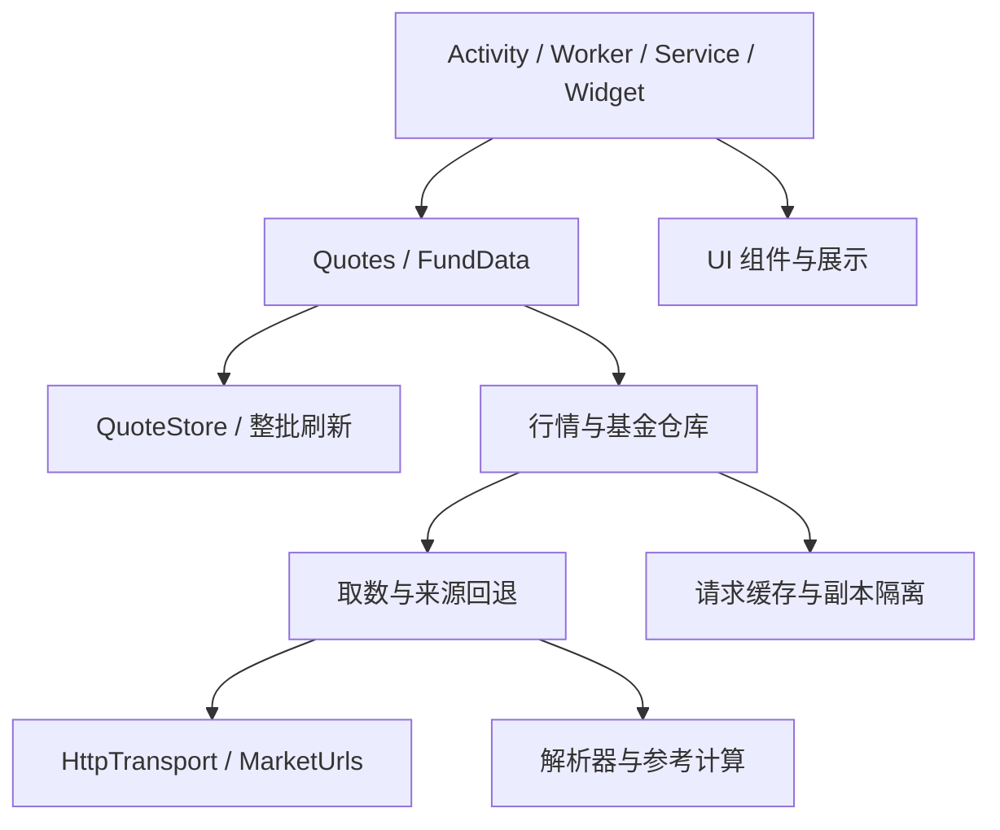

# 代码结构与维护

本次重构保留应用包名、版本、三个页面、对话框入口和 JSON 数据格式。没有新增运行时框架或产品功能。

## 职责边界

| 模块 | 主要文件 | 负责的内容 |
|---|---|---|
| Android 宿主 | `MainActivity`、`MarketWidget`、`RefreshWorker`、`LiveService` | 页面组装、生命周期、小组件和系统任务 |
| UI 组件 | `ui/WatchlistEditor`、`ui/FundDialogs`、`ui/QuoteDetailsDialog` | 自选草稿及恢复、基金查询/添加、详情弹窗 |
| 视图样式 | `ui/ViewFactory`、`ui/ViewTheme` | 复用现有原生控件尺寸、颜色与字体 |
| 文本展示 | `ui/FundPresentation`、`ui/QuotePresentation` | 纯文本格式化，不发网络请求、不改缓存；可在 JVM 测试 |
| Android 存储 | `data/QuoteStore`、`data/WatchlistCodec` | 偏好设置适配、自选编码校验、整批发布 |
| 行情数据 | `data/MarketDataSource`、`data/QuoteRepository` | 单个来源取数、备用源顺序、缓存和交叉核验 |
| 基金数据 | `data/FundRepository`、`FundReferenceData`、`data/FundReferenceSources` | NAV/IOPV 缓存、持仓参考请求编排、历史价/汇率源回退 |
| 请求缓存 | `data/JsonRequestCache` | 在途复用、成功/失败 TTL、等待期限和返回副本 |
| 时间与规则 | `data/MarketTime`、`data/ReferencePolicy`、`data/HoldingMarkets` | 北京时间、数据时效限制、已核验市场/币种映射 |
| 解析与计算 | `FundHoldings`、`data/PriceHistoryParser`、`FundReference`、原有行情解析器 | 校验数据来源与日期，计算贡献，保留无效/缺失状态 |
| HTTP | `network/HttpTransport`、`network/UrlConnectionTransport`、`network/MarketUrls` | 可替换的 HTTP 边界、连接策略和接口参数 |

`Quotes`、`FundData` 保留为旧调用点的轻量入口。`data/MarketServices` 是默认依赖装配位置，统一连接 HTTP、时钟、基金仓库和行情仓库。仓库不回调这些静态入口，消除了原先 `Quotes` ↔ `FundData` 的依赖环。



行情备用缓存和持仓请求缓存保留不同规则：首选行情每次尝试刷新；备用行情 60 秒内可复用。持仓请求需要复用在途工作，成功持仓缓存一天，失败只缓存 60 秒。没有为了统一类型而改变这些行为。

## 兼容约束

- 偏好设置文件继续为 `market`。`watch`、行情代码、`error:<代码>`、`attempt`、`fundMarket:<代码>` 及盯盘配置键保持原样，已有自选和缓存无需迁移。
- 对话框草稿仍使用 `draftNames` / `draftCodes` 保存与恢复，未保存修改与行顺序保持原行为。
- 每批全部请求收集完后，用一次偏好设置更新发布；失败标记不能覆盖之前成功的行情。
- ETF 的 NAV 与 IOPV 独立失败；持仓参考不覆盖平台估值或正式 NAV，也不参与股票行情核验。
- 基金公式、支持市场、时效门槛和文案保持不变。函数兼容入口继续转发到独立解析/展示模块。

## 修改指南

- 调整接口路径或字段参数：修改 `MarketUrls` 和相关解析器，不在 UI 中拼接 URL。
- 修改数据回退或缓存规则：修改对应仓库/缓存，并更新可注入 HTTP、时钟的测试。
- 修改参考公式：修改 `FundReference`；修改阈值：修改 `ReferencePolicy`。持仓解析与币种映射单独测试。
- 修改弹窗或编辑交互：修改对应 `ui` 组件，避免把控件状态重新放回 `MainActivity`。
- 修改文案：修改纯展示类；`presentation-contract.json` 保存重构前的四种展示样例，文案有意变动时再更新该基准。
- 新增字段时，明确其来源、单位与日期；不要把请求时间、缺失值或未知持仓当成真实行情。

## 构建与验证

先设置本机 JDK 17 或更新版本的 `JAVA_HOME`，再运行：

```powershell
.\build.ps1 -Verify
```

该入口同时执行 APK 构建、JVM 单元测试和 Android lint。普通 `build.ps1` 仍只生成调试 APK；脚本使用指定的 JDK，不写死某台开发机的路径，JDK 无效时先给出明确错误。SDK 与 Gradle 仍沿用 `.tools` 的现有安装方式。

本次通过原有 126 项回归测试和新增 26 项测试。新增验证覆盖来源回退、字符编码与时区、NAV/备用源缓存隔离、在途复用与超时、失败重试、批次结果、参数构造、文案和参考值分离。展示基准通过从重构前提交编译出的代码生成，四种样例文字逐项一致。

实际 Java 请求链路再次查询 017436、100055、000001、005827，四只均取得持仓参考结果。证据保存在本地 `output/verification/refactor/live-results.json`。这证明当次取数链路可用；没有连接设备，尚未进行手机安装、旋转屏幕与弹窗焦点的运行时验收。
